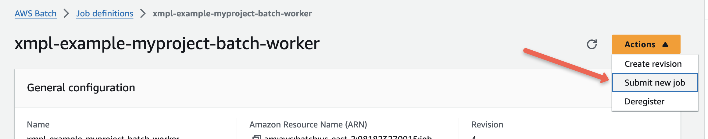
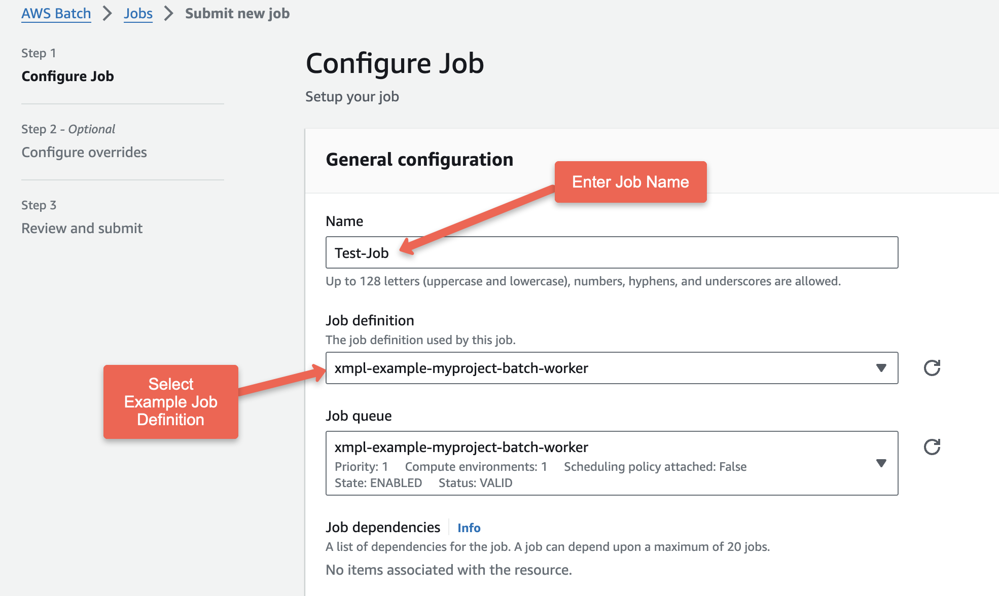
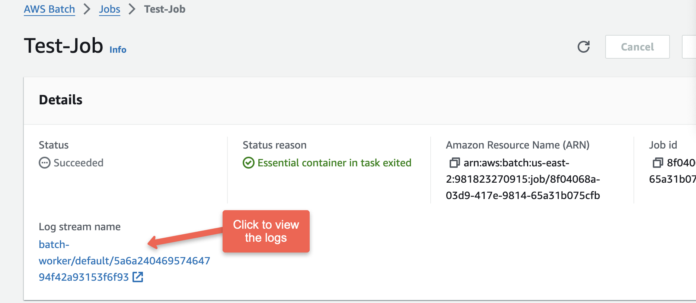
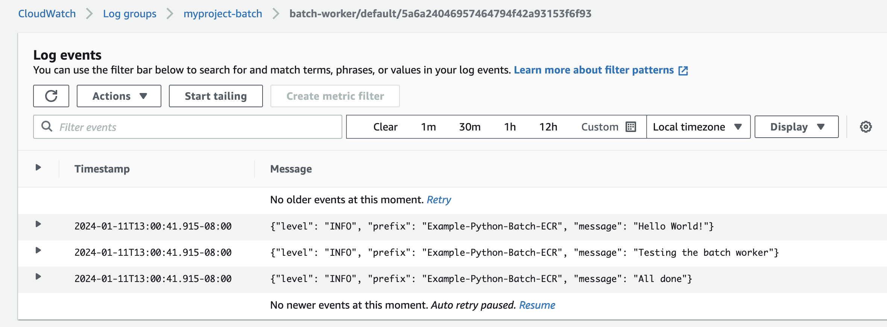

# AWS Batch Terraform Module Example

## How To Run and Test the Example

1) Initialize:

    ```sh
    terraform init
    ```

1) Plan

    ```sh
    terraform plan
    ```

1) Apply

    ```sh
    terraform apply
    ```

1) Test the batch worker:

    1) Navigate to "Job Definitions" in "AWS Batch" in the AWS console: <https://us-east-2.console.aws.amazon.com/batch/home?region=us-east-2#job-definition>

    1) Select the `xmpl-example-myproject-batch-worker` job definition.

    1) In the upper right, click the "Action" dropdown and click "Submit new job".

        

    1) Configure the job by entering a name for the job and selecting the example job definition.

        

    1) Click "Next"

    1) In the "Configure overrides" screen, click "Next"

    1) In the "Review and submit" screen, click "Create Job".

        The job will start. The "Status" will progress from "Pending..." to "Runnable..." to "Succeeded".

    1) Once the job has "Succeeded", click the "Log stream name" to view the logs.

        

    1) The logs should look something like:

        

## To Use a Different Image

Create a file in the example folder named `terraform.tfvars`.
Add an entry setting the desired image tag to the `batch_ecr_tag` variable, like:

```ini
batch_ecr_tag=new-image-tag
```

Run plan and the apply.

## How To Destroy the Example

1) Destroy the resources

    ```sh
    terraform destroy
    ```

## Module Specs

[SPECS.md](./SPECS.md)
