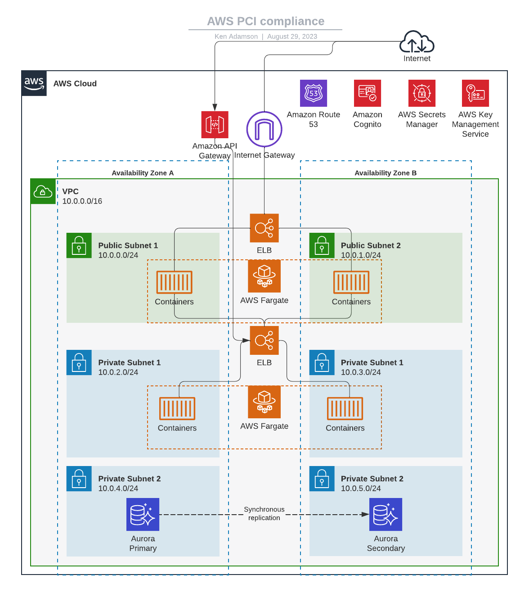

# Terraform for AWS (front end with api)

## Requirements

- [AWS CLI](https://docs.aws.amazon.com/cli/latest/userguide/cli-chap-install.html) configured with your credentials (~/.aws/credentials)
- [Terraform CLI](https://learn.hashicorp.com/tutorials/terraform/install-cli) tool installed
  - This repo is set up to use [asdf](https://github.com/asdf-community/asdf-hashicorp)

## Setup

- Change directories to the appropriate terraform project (ie `cd ./Fargate_API_FE_DB`)
- Run `terraform init` to initialize needed terraform plugins.

## Variables

Variables for are set as defaults in the [`.variables.tf`](./variables.tf) file. Some of these defaults may work fine, but many need actual values set.

To override the default values, create a `terraform.tfvars` file in appropriate terraform folder. Find out more about [.tfvars files](https://www.terraform.io/docs/language/values/variables.html#variable-definitions-tfvars-files).

## Architectural Diagrams

AWS PCI Compliance:

